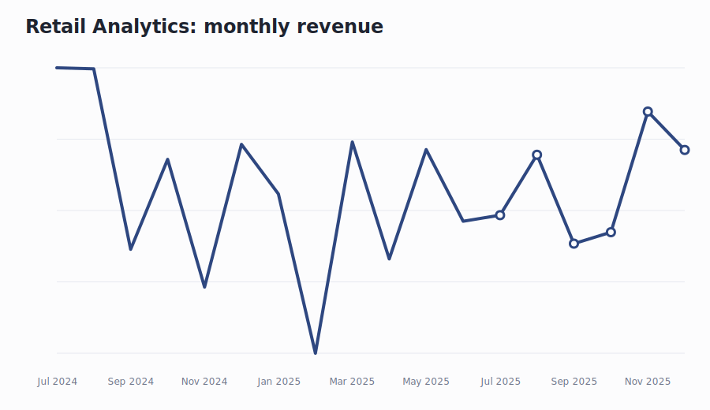
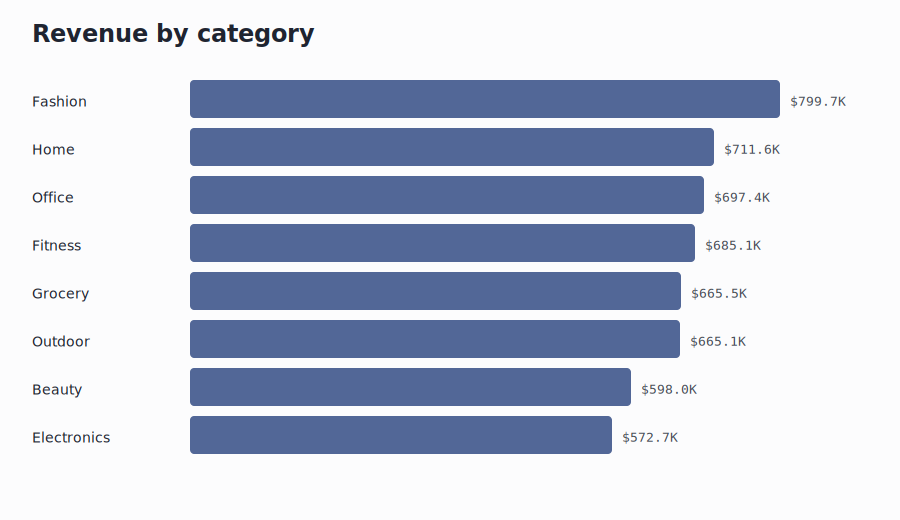
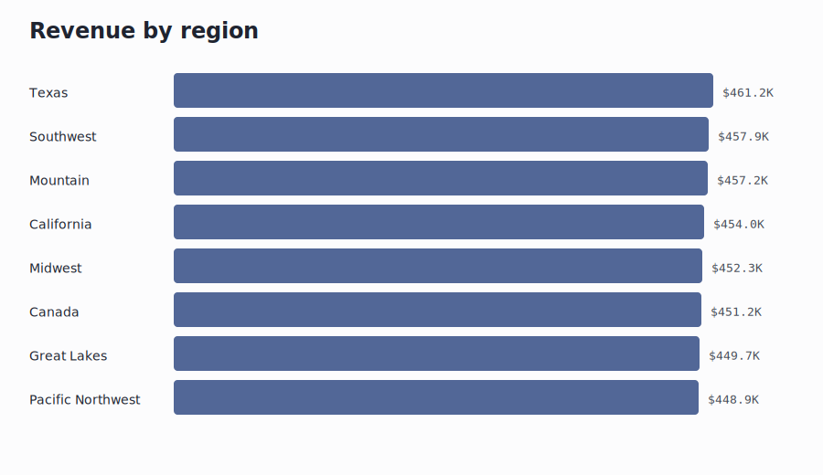
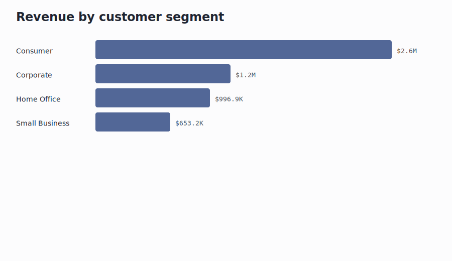
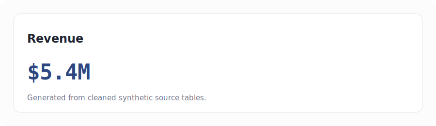
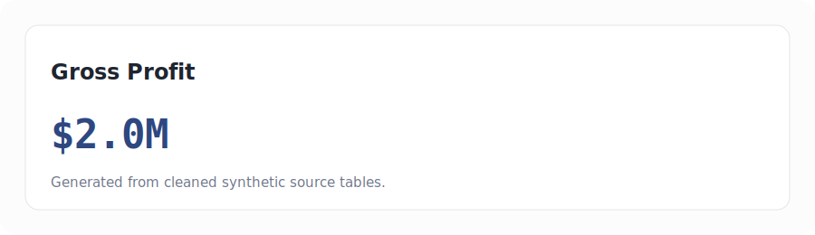

# Retail & E-Commerce Sales Analytics Dashboard


## Table of Contents

- [Project Overview](#project-overview)
- [Business Problem](#business-problem)
- [Dataset Description](#dataset-description)
- [Data Model](#data-model)
- [KPIs](#kpis)
- [SQL Analysis](#sql-analysis)
- [Python Analysis](#python-analysis)
- [Excel Analysis](#excel-analysis)
- [Power BI Dashboard](#power-bi-dashboard)
- [Screenshots](#screenshots)
- [Key Insights](#key-insights)
- [Business Recommendations](#business-recommendations)
- [Architecture Diagram](#architecture-diagram)
- [Tech Stack](#tech-stack)
- [Repository Structure](#repository-structure)
- [How To Run](#how-to-run)
- [Future Improvements](#future-improvements)
- [Resume Achievements](#resume-achievements)

## Project Overview

Retail Analytics is a production-style analytics portfolio project with synthetic enterprise data, SQL analysis, Python notebooks, Excel dashboards, Power BI specifications, executive reports, and recruiter-ready documentation.

## Business Problem

The goal is to give leaders a reliable way to monitor performance, diagnose drivers, and prioritize operational improvements using a clean KPI model.

## Dataset Description

Raw source-like CSVs live in `data/raw` and include missing values, duplicates, outliers, date fields, and foreign key relationships. Cleaned analytical CSVs live in `data/cleaned`.

## Data Model

See `architecture/er_diagram.md` for the entity relationship diagram and `docs/data_dictionary.md` for field-level context.

## KPIs

| KPI | Value |
|---|---:|
| Revenue | $5.4M |
| Gross Profit | $2.0M |
| Profit Margin | 36.8% |
| Average Order Value | 69.7 |
| Customer Acquisition Cost | 3,538.1 |
| Customer Retention Rate | 82.2% |
| Repeat Purchase Rate | 96.7% |
| Customer Lifetime Value | 945.9 |
| Monthly Revenue Growth | 0.2% |
| Regional Growth Rate | 2.4% |
| Top Products | Fashion, Home, Office, Fitness, Grocery |
| Bottom Products | Fitness, Grocery, Outdoor, Beauty, Electronics |

## SQL Analysis

SQL files in `sql/` cover schema setup, CSV loading, KPI analysis, data quality checks, growth trends, and window-function examples.

## Python Analysis

Notebook files in `notebooks/` cover EDA, cleaning, feature engineering, visualization, and business insights.

## Excel Analysis

The workbook in `excel/` includes dashboard cards, pivot-style summaries, pivot charts, lookup examples, cleaning examples, conditional formatting, KPI tracking, and an executive summary.

## Power BI Dashboard

Power BI build specifications, theme JSON, and DAX measure stubs are in `dashboards/powerbi/`. The local HTML dashboard is `dashboards/dashboard.html`.

## Screenshots








## Key Insights

- Performance varies meaningfully across time and business segments.
- Cleaned source tables provide an auditable base for SQL, Python, Excel, and BI artifacts.
- The dashboard is organized around executive status first, then driver exploration.

## Business Recommendations

1. Refresh the SQL quality checks before every dashboard update.
2. Use the strongest segment and weakest segment each month as the core operating review.
3. Extend the notebooks with forecasting once the Power BI model is finalized.

## Architecture Diagram

See `architecture/project_architecture.md` and `architecture/data_flow.md`.

## Tech Stack

PostgreSQL, Python, pandas, numpy, matplotlib, plotly, scikit-learn, Faker, Excel, Power BI, Git, GitHub Pages.

## Repository Structure

```text
data/raw
data/cleaned
sql
excel
notebooks
scripts
dashboards
reports
visuals
docs
architecture
```

## How To Run

```bash
python -m pip install -r requirements.txt
python scripts/validate_data.py
```

Open `dashboards/dashboard.html`, `excel/retail-ecommerce-sales-analytics_analysis_workbook.xlsx`, and `reports/executive_report.pdf` for the main artifacts.

## Future Improvements

- Publish a real `.pbix` after loading the model in Power BI Desktop.
- Add dbt models for production-grade transformations.
- Add automated CI data quality checks.

## Resume Achievements

See `resume_bullets.md`.

## Author

Yadav - Data Analyst Portfolio
## Project Overview

Retail E-Commerce Analytics project built as a recruiter-ready analytics case study with reproducible data, SQL, Python, dashboards, reports, and business recommendations.

## Dataset Information

Data is organized into `data/raw` and `data/processed` so reviewers can distinguish source-like inputs from analysis-ready outputs.

## Tech Stack

Python, pandas, SQL, Excel/BI planning, dashboard documentation, Git, and GitHub.

## Architecture Diagram

See `docs/` and dashboard documentation for the data flow, modeling approach, and reporting layers.

## Project Workflow

1. Generate or collect source-like data.
2. Validate and clean the dataset.
3. Build processed analytical tables.
4. Analyze KPIs with SQL and Python.
5. Create dashboard and reporting assets.
6. Convert insights into recommendations.

## KPIs

- Revenue
- Gross Profit
- AOV
- CAC
- Retention Rate
- CLV

## Methodology

The analysis uses data quality checks, KPI aggregation, segment analysis, trend analysis, and business recommendation framing.

## Visualizations

Dashboard previews and chart assets are stored in `images/`.

## Dashboard Screenshots

Dashboard documentation and walkthrough files are stored in `dashboards/`.

## Key Insights

- The project identifies performance patterns across the most important business dimensions.
- Processed datasets make the analysis reproducible.
- The dashboard flow supports executive review and analyst drill-down.

## Business Recommendations

- Review the weakest segment first for short-term improvement.
- Use the strongest segment as a performance benchmark.
- Track the core KPI set weekly.

## Folder Structure

```text
data/raw
data/processed
notebooks
sql
dashboards
reports
images
src
docs
```

## Results

The repository now meets a standardized recruiter-ready analytics portfolio structure.

## Future Enhancements

- Add live BI platform files when Power BI Desktop or Tableau is available.
- Add automated CI checks for data quality.
- Add forecasting models where historical signal supports it.

## Author

Ravikant Yadav - Data Analyst Portfolio
