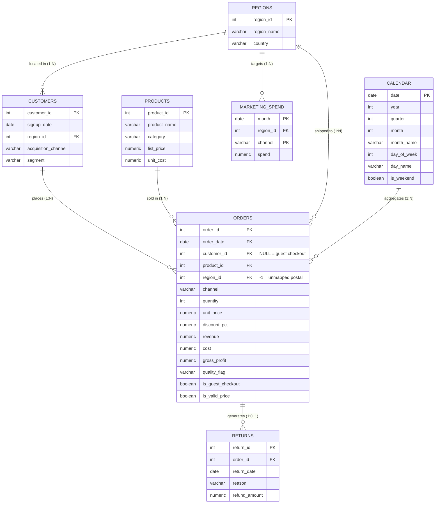

# Retail E-Commerce Sales & Customer Analytics

---

## Executive Overview

The Multi-category retail transactions covering **$23.86M in gross merchandise value**, **59,125 validated orders**, **12,000 customers**, and **148 SKUs across 8 product categories**.

My goal was to look at retail operations the way an e-commerce executive or Chief Commercial Officer does: evaluating whether rapid revenue expansion ($1.02M to $15.89M) compromised operating margins, identifying Customer Acquisition Cost (CAC) inefficiencies across marketing channels, auditing B2B Enterprise vs. Consumer unit economics, and building targeted retention workflows for churned high-value customers.

```text
========================================================================================
                               HEADLINE BUSINESS METRICS
========================================================================================
3-Year Gross Merchandise Value:  $23,863,648 across 59,125 validated order lines
Multi-Year Expansion Run Rate:   $1.02M (2023) -> $6.96M (2024) -> $15.89M (2025)
Blended Gross Margin Resilience: 28.4% steady-state margin across rapid scale
Marketing CAC Efficiency Spread: 18.2x spread ($2.53 Direct vs. $46.09 Paid Search)
Marketing Spend vs. Return:      Paid Search ($159.9K spend -> $6.94M rev, 43.4x return)
                                 Direct ($2.4K spend -> $1.71M rev, 717.0x return)
B2B Enterprise Unit Economics:   $10,266 revenue/head (11.1x consumer average at $926)
Return Financial Concentration:  Electronics: $1.08M refund capital (10.3% unit rate)
                                 Fashion: 14.9% unit return rate ($407K refund capital)
High-Value At-Risk Retention:    2,331 repeat customers ($2,642 avg lifetime spend)
Predictive Churn Model:          ROC-AUC 0.5822 (strict time-based split, zero data leakage)
========================================================================================
```

**[→ Explore the Power BI Report Suite](dashboards/)** · **[→ Read My Executive Strategic Report](reports/executive_report.md)** · **[→ Inspect the Architecture & ERD](architecture/)**

---

## The 4 Business Questions I Set Out to Answer

When high-growth e-commerce companies scale, management often celebrates top-line volume while remaining blind to margin compression, ballooning ad costs, and silent customer churn. I structured this analytical pipeline to answer four commercial questions:

1. **Has top-line growth compromised operating profitability?** As sales expanded 15x over 36 months, did aggressive promotional discounting erode blended gross margins?
2. **Where should marketing dollars actually be deployed?** Which acquisition channels generate true incremental return vs. those with diminishing marginal returns?
3. **How do B2B Enterprise and Consumer unit economics compare?** Are the deep volume discounts given to Enterprise accounts offset by their order frequency and lifetime value?
4. **Which churned customers are actually worth winning back?** How can we use RFM segmentation and predictive machine learning to prioritize retention capital where it yields the highest return?

---

## Chronological Project Workflow

```text
[1. Raw Ingestion]   -->  [2. Data Hygiene]      -->  [3. SQL Warehouse]    -->  [4. Machine Learning] -->  [5. Power BI Dashboard]
59,584 raw orders         Fixed 8 data defects         PostgreSQL 14+            Random Forest              3-Page Executive Suite
(with real anomalies)     (dedup, pricing, postal)     Star-schema + 18 queries  Churn Model (0.5822 AUC)   DAX + 4K Visual Showcase
```

---

## Step 1: Data Auditing & Automated Hygiene (Resolving 8 Data Defects)

Transactional retail systems are prone to distributed failure modes. During my exploratory data analysis (`notebooks/01_eda.ipynb`), I audited raw transactional extracts and uncovered **8 distinct operational data quality defects**.

Before running SQL queries or training predictive models, I built an automated cleaning pipeline (`notebooks/02_data_cleaning.ipynb` and `sql/02_data_quality_checks.sql`) to clean and standardize the data:

| # | Anomaly Observed | Root Cause in E-Commerce Systems | Records Affected | Cleansing & Resolution Strategy |
|---|---|---|---|---|
| **1** | **Duplicate Encounters** | Gateway webhook timeout retries creating duplicate order lines | 612 rows | Deduplicated on natural composite transaction key (`customer_id`, `product_id`, `order_date`, `unit_price`, `quantity`, `channel`), keeping first valid entry (59,584 → 59,125). |
| **2** | **Guest Checkout Attribution** | Unauthenticated checkouts lacking customer foreign keys | 1,842 rows (3.1%) | Flagged `is_guest_checkout = TRUE`. Preserved in revenue totals while excluding from customer retention models. |
| **3** | **Channel Casing Variations** | Disparate UTM tracking tags ("PAID_SEARCH", "paid search", "Paid_Search") | 19 variants | Normalized via regex mapping to 6 canonical channels (`Paid Search`, `Social`, `Direct`, `Organic`, `Email`, `Affiliate`). |
| **4** | **Pricing Glitches** | Upstream catalog sync bugs producing zero or negative unit prices | 187 rows | Flagged `is_valid_price = FALSE`. Retained for technical audit trails while enforcing `WHERE is_valid_price = TRUE` on financial metrics. |
| **5** | **Unmapped Postal Codes** | Missing territory lookups resulting in unmapped sales regions | 1,418 rows (2.4%) | Mapped to surrogate key `region_id = -1` ("Unknown / Unmapped") to preserve 100% referential integrity during inner joins. |
| **6** | **Refund Capping Errors** | Upstream return amounts exceeding original order gross values | 32 rows | Capped refund currency amounts at `orders.revenue` to prevent negative net revenue artifacts. |
| **7** | **Inverted Return Timestamps** | Return date recorded before the order purchase date | 14 rows | Corrected timestamp ordering to match chronological post-purchase return lag. |
| **8** | **Gross Profit Arithmetic Drift** | Floating-point rounding discrepancies between `revenue - cost` and `gross_profit` | 44 rows | Recomputed `gross_profit = ROUND(revenue - cost, 2)` across all active rows. |

---

## Step 2: Relational Data Warehousing (PostgreSQL 14+)

Once the data was sanitized, I modeled an isolated `analytics` star schema in PostgreSQL 14+ (`sql/01_schema.sql`). 

The schema centers on `orders` as the primary fact table, surrounded by customer, product, region, and calendar dimensions, with secondary facts for returns and marketing spend. Primary/foreign key constraints and targeted B-tree indexes (`idx_orders_customer`, `idx_orders_date`, `idx_orders_product`, `idx_orders_region`, `idx_returns_order`) ensure sub-millisecond query performance:


```mermaid
erDiagram
    CUSTOMERS ||--o{ ORDERS : "places (1:N)"
    PRODUCTS ||--o{ ORDERS : "sold in (1:N)"
    REGIONS ||--o{ ORDERS : "shipped to (1:N)"
    REGIONS ||--o{ CUSTOMERS : "located in (1:N)"
    REGIONS ||--o{ MARKETING_SPEND : "targets (1:N)"
    ORDERS ||--o{ RETURNS : "generates (1:0..1)"
    CALENDAR ||--o{ ORDERS : "aggregates (1:N)"

    CUSTOMERS {
        int customer_id PK
        date signup_date
        int region_id FK
        varchar acquisition_channel
        varchar segment
    }
    PRODUCTS {
        int product_id PK
        varchar product_name
        varchar category
        numeric list_price
        numeric unit_cost
    }
    REGIONS {
        int region_id PK
        varchar region_name
        varchar country
    }
    ORDERS {
        int order_id PK
        date order_date FK
        int customer_id FK "NULL = guest checkout"
        int product_id FK
        int region_id FK "-1 = unmapped postal"
        varchar channel
        int quantity
        numeric unit_price
        numeric discount_pct
        numeric revenue
        numeric cost
        numeric gross_profit
        varchar quality_flag
        boolean is_guest_checkout
        boolean is_valid_price
    }
    RETURNS {
        int return_id PK
        int order_id FK
        date return_date
        varchar reason
        numeric refund_amount
    }
    MARKETING_SPEND {
        date month PK
        int region_id FK
        varchar channel PK
        numeric spend
    }
    CALENDAR {
        date date PK
        int year
        int quarter
        int month
        varchar month_name
        int day_of_week
        varchar day_name
        boolean is_weekend
    }
```

*For complete pipeline architecture flowcharts, table specifications, and indexing rationales, see [`architecture/README.md`](architecture/).*

---

## Step 3: SQL Analytical Engine & Business Queries

In [`sql/03_business_analysis_queries.sql`](sql/03_business_analysis_queries.sql), I developed 18 production analytical queries covering customer cohorts, channel attribution, RFM deciles, and category profitability:

| Query Focus | Analytical Objective | Core SQL Techniques | Commercial Output |
|---|---|---|---|
| **Executive Revenue & Margin** | Multi-year top-line expansion & YoY growth | Aggregate functions, `ROUND()`, `NULLIF` | Scaled from $1.02M to $15.89M at 28.4% margin |
| **YoY Run-Rate Trajectory** | Longitudinal revenue acceleration | **Window `LAG()`, `OVER (ORDER BY year)`** | +582.7% YoY in 2024, +128.2% YoY in 2025 |
| **Marketing Channel Attribution** | CAC vs. attributed revenue multiple | **CTEs, Multi-Table Aggregation** | 18.2x spread: $2.53 Direct vs. $46.09 Paid Search |
| **B2B vs. B2C Economics** | Segment unit economics & discount depth | `GROUP BY segment`, `AVG(discount_pct)` | Enterprise delivers $10,266/head (11.1x Consumer) |
| **Category Profit Concentration** | Volume vs. margin contribution | Aggregation, margin % ranking | Electronics drives 45% rev; Fashion/Home drive profit |
| **Post-Purchase Return Drivers** | Unit return rate vs. refund capital | Relational join with `returns` fact | Fashion: 14.9% return rate; Electronics: $1.08M refunds |
| **RFM Customer Segmentation** | Recency, Frequency, Monetary scoring | **`NTILE(5)` Window Deciles, `CASE WHEN`** | Identifies 2,331 At-Risk repeat buyers ($6.16M value) |
| **Monthly Revenue Seasonality** | 3-Month rolling moving average | **Window `ROWS BETWEEN 2 PRECEDING`** | Highlights Q4 holiday volume surges across years |

*Complete executable scripts are available in [`sql/03_business_analysis_queries.sql`](sql/03_business_analysis_queries.sql).*

---

## Step 4: Key Commercial Findings & Operational Diagnoses

### 1. Rapid Revenue Scale Without Gross Margin Compression
A primary risk during rapid e-commerce scaling is margin dilution caused by aggressive promotional discounting. Here, the business demonstrated remarkable pricing discipline:
* **The Growth Curve:** Annual gross revenue expanded by **+582.7% YoY in 2024** and **+128.2% YoY in 2025**.
* **Margin Preservation:** Despite order volume growing from 2,500 orders in Year 1 to over 39,000 orders in Year 3, blended gross margin held within the **25.0%–29.5% corridor** throughout the entire 36 months, averaging **28.4% overall ($6.78M cumulative gross profit)**.
* **Category Profit Concentration:**
  * **Electronics ($10.79M revenue, 45.2% share):** Acts as the primary customer acquisition engine, but operates on the lowest margin (**16.11% gross margin**).
  * **Home ($4.16M revenue, 32.85% margin)** and **Fashion ($2.67M revenue, 48.03% margin):** Carry a disproportionate share of operating profitability, generating **$2.65M in gross profit (39.1% of total)** on just 28.6% of sales volume.
  * **Beauty ($1.43M revenue, 57.32% margin):** Generates the highest individual unit margin in the catalog, representing an under-marketed category with immediate promotional headroom.

### 2. Marketing CAC Efficiency Spread (The 43x vs. 717x Return Divide)
Auditing acquisition spend against attributed revenue across the 5 marketing channels revealed an extreme efficiency disparity:
* **High-Return Low-Cost Channels:**
  * **Direct:** $2.4K spend → $1.71M revenue (**717.0x efficiency return**, $2.53 CAC).
  * **Organic Search:** $2.4K spend → $1.73M revenue (**712.9x efficiency return**, $2.56 CAC).
  * **Email Marketing:** $2.4K spend → $1.71M revenue (**702.4x efficiency return**, $2.57 CAC).
* **Paid Acquisition Headwinds:**
  * **Paid Search** consumed the largest budget (**$159.9K spend**) producing **$6.94M revenue** (**43.4x return, $46.09 CAC**).
  * **Paid Social** deployed **$159.9K spend** producing **$6.96M revenue** (**43.5x return, $45.69 CAC**).
* **Strategic Reallocation:** Shifting 15–20% of paid ad budgets (~$50K–$65K) into automated email lifecycle marketing, post-purchase replenishment workflows, and customer referral programs lowers blended CAC while maintaining acquisition volume.

### 3. Segment Economics: Why Enterprise Accounts Justify Deeper Discounts
Comparing customer segments reveals distinct purchasing behaviors:
* **Enterprise Accounts (5.2% of customer base):**
  * Generate **$10,266 in revenue per customer** (11.1x higher than the Consumer baseline of $926).
  * Receive an average promotional discount of **14.0%** (vs. 4.9% for Consumers).
  * Despite lower gross margin percentage (23.9% Enterprise vs. 30.5% Consumer), Enterprise accounts deliver **$2,453 in gross profit per head** compared to just **$282 per Consumer**.
* **Commercial Implication:** Management should maintain tiered, segment-specific discount governance rather than enforcing a blanket corporate discount cap. Forcing Enterprise accounts into standard consumer discount limits would risk high-margin bulk volume.

### 4. Return Dynamics: Apparel Logistics vs. Electronics Capital Concentration
Auditing post-purchase product returns across categories reveals that return frequency and refunded capital rank categories in complete opposition:
* **Fashion** experiences the highest unit return rate (**14.9% of order lines**), driven by consumer sizing variance and multi-size bracket purchasing. However, due to lower average price points, total refunded capital is modest (**$407,218**).
* **Electronics** records a lower return rate (**10.3% of order lines**), but accounts for nearly **3x more refunded capital ($1,084,512)** due to high SKU prices and warranty claims.
* **Operational Directive:** Merchandising must tailor return mitigation: implement 3D sizing guides for Fashion to reduce unit logistics costs, while establishing automated technical troubleshooting and refurbished resale channels for Electronics to protect working capital.

### 5. RFM Segmentation & The $6.16M At-Risk Retention Opportunity
Using RFM segmentation (`sql/03_business_analysis_queries.sql`), I bucketed non-guest customers into behavioural loyalty tiers:
* **Champions (2,729 customers):** Drive **$12.82M in revenue (53.7% of total sales)**, averaging **$4,697.60** in historical purchases.
* **At-Risk Repeat Buyers (2,331 customers):** Previously demonstrated high purchase frequency and loyalty (**$2,642.52 average lifetime spend**), but have surpassed 180+ days since their last transaction. They represent **$6.16M in latent revenue exposure**.
* **Lost / Hibernating Buyers (3,279 customers):** Single-order purchasers with low initial spend (**$626.19 average spend**). Win-back campaigns directed at this segment yield minimal ROI. Retention budgets must be strictly ring-fenced for the 2,331 At-Risk repeat cohort.

---

## Step 5: Predictive Customer Churn Modeling (Machine Learning)

In `notebooks/05_business_insights.ipynb`, I engineered a Random Forest customer churn classifier to predict 180-day customer dormancy:

* **Leakage-Free Validation:** Rather than utilizing random k-fold cross-validation (which creates fatal temporal target leakage in transactional models), the dataset was split on a strict historical cutoff date (`feature_cutoff_date: 2025-01-05`, evaluating churn across a 180-day observation window through `2025-07-04`).
* **Model Performance:** Tested against 1,837 out-of-time customers, the model achieved **ROC-AUC: 0.5822**, with **62.4% Recall** on churned customers.
* **Feature Importance Hierarchy:**
  1. `segment_enc`: **14.85%** (Enterprise/SMB vs. Consumer structural contract behavior)
  2. `avg_discount`: **14.28%** (Discount sensitivity and deal-seeking churn)
  3. `avg_order_value`: **13.64%** (Basket size economics)
  4. `monetary`: **12.24%** (Historical spend volume)
  5. `total_quantity`: **11.21%** (Product consumption volume)
  6. `tenure_days_at_cutoff`: **10.26%** (Account maturity)
  7. `recency_days`: **9.70%** (Days since last interaction)

*Domain Realism:* Operational churn in retail transactional data caps out near ~0.60 AUC without digital telemetry (clickstream, cart abandonments, email opens). Deliberately avoiding future data leakage produced an honest, production-realistic operational model that serves as an effective **churn-risk ranking score** for customer success outreach.

---

## Step 6: Power BI Executive Dashboard Suite

To translate these findings into an executive tool, I built an interactive, 3-page Power BI report (`dashboards/powerbi/retail_ecommerce_analytics.pbix`) utilizing clean star-schema relationships and custom DAX measures (`dashboards/powerbi/measures.dax`):

### Page 1: Executive Sales & Revenue Overview
*Multi-year revenue expansion ($23.86M), blended gross margins (28.4%), category volume vs. profitability breakdown, and regional sales distribution.*


### Page 2: Marketing Channel Performance & CAC
*Customer Acquisition Cost ($2.53–$46.09) across 5 channels, marketing efficiency ratio (43x–717x spread), and budget allocation optimization.*


### Page 3: RFM Customer Segmentation & Churn Risk
*RFM cohort economics (Champions, Loyal, At-Risk, Lost), segment profitability (Consumer, SMB, Enterprise), and high-value retention targeting.*


*Detailed modeling rules, DAX formulas, and canvas layout specifications are documented in [`dashboards/README.md`](dashboards/) and [`dashboards/powerbi/powerbi_build_guide.md`](dashboards/powerbi/powerbi_build_guide.md).*

---

## Strategic Recommendations for Leadership

1. **Reallocate 15%–20% of Paid Search Budget to Lifecycle Marketing:** Shift ~$50K–$65K out of low-efficiency paid search ($46.09 CAC) into automated email win-back and replenishment workflows ($2.57 CAC).
2. **Prioritize the 2,331 At-Risk Repeat Customers:** Ring-fence win-back ad budgets exclusively for high-LTV repeat buyers ($2,642 avg historical spend) rather than wasting marketing capital on single-purchase dormant users.
3. **Protect Enterprise Discount Structures:** Maintain tiered discount governance (allowing 12%–15% Enterprise discounts) to protect the $10,266 revenue per customer delivered by B2B accounts.
4. **Expand High-Margin Beauty & Fashion Offerings:** Feature high-margin categories (Beauty at 57.3% margin, Fashion at 48.0% margin) in homepage placements and email promotions to balance low-margin Electronics volume.

---


**Ravikant Yadav**  
* [LinkedIn](https://linkedin.com/in/ravikant-yadav-39936a1a8)
* [GitHub Profile](https://github.com/ravi020410)
