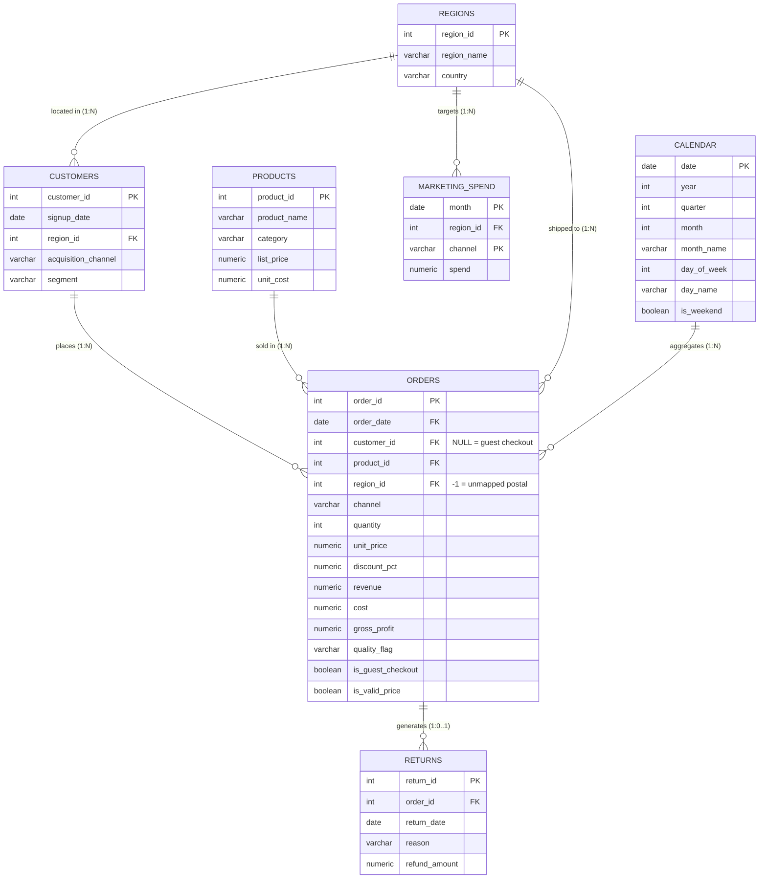

# Data Architecture & Relational Star Schema

## Entity-Relationship Diagram (PostgreSQL Star Schema)

---

## Relational Data Model Specifications

| Entity Name | Database Object | Primary Key | Foreign Keys | Relationship Type | Record Volume | Description |
|---|---|---|---|---|---|---|
| **Orders** | `analytics.orders` | `order_id` | `customer_id`, `product_id`, `region_id`, `order_date` | Central Fact Table | 59,125 rows | Line-item transactional facts capturing unit volume, realized price, discount percentages, net revenue, direct cost, and gross profit. |
| **Customers** | `analytics.customers` | `customer_id` | `region_id` | Dimension (1:N with Orders) | 12,000 rows | Customer demographic master holding signup timestamp, geographic territory, primary acquisition channel, and business segment. |
| **Products** | `analytics.products` | `product_id` | None | Dimension (1:N with Orders) | 148 rows | Product catalog dimension containing SKU nomenclature, merchandise category, MSRP list price, and base unit cost. |
| **Regions** | `analytics.regions` | `region_id` | None | Dimension (1:N with Orders/Spend) | 7 rows | Geographic sales territories mapping 6 domestic operational regions plus surrogate key (`region_id = -1`) for unmapped postal codes. |
| **Returns** | `analytics.returns` | `return_id` | `order_id` | Secondary Fact (1:0..1 with Orders) | 4,589 rows | Post-purchase returns ledger logging return date, return driver categorization, and capped refund currency amounts. |
| **Marketing Spend** | `analytics.marketing_spend` | (`month`, `channel`, `region_id`) | `region_id` | Secondary Fact (Monthly) | 1,296 rows | Longitudinal marketing investment ledger recording 36 months of promotional capital deployed across 6 acquisition channels and 6 operational regions. |
| **Calendar** | `analytics.calendar` | `date` | None | Dimension (1:N with Orders) | 1,096 rows | Continuous daily date spine (2023-01-01 to 2025-12-31) providing standardized time intelligence, fiscal quarters, and holiday flags. |

---

