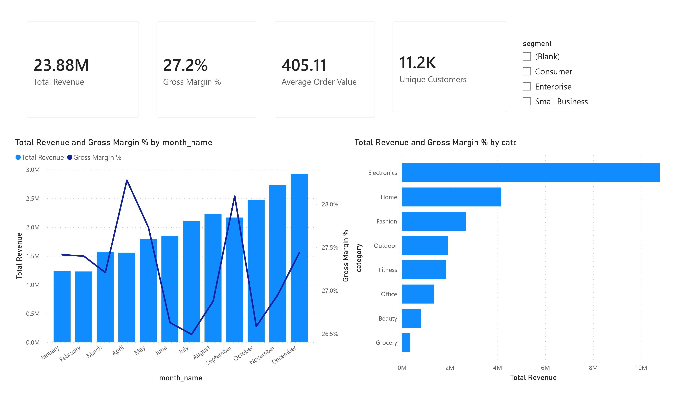
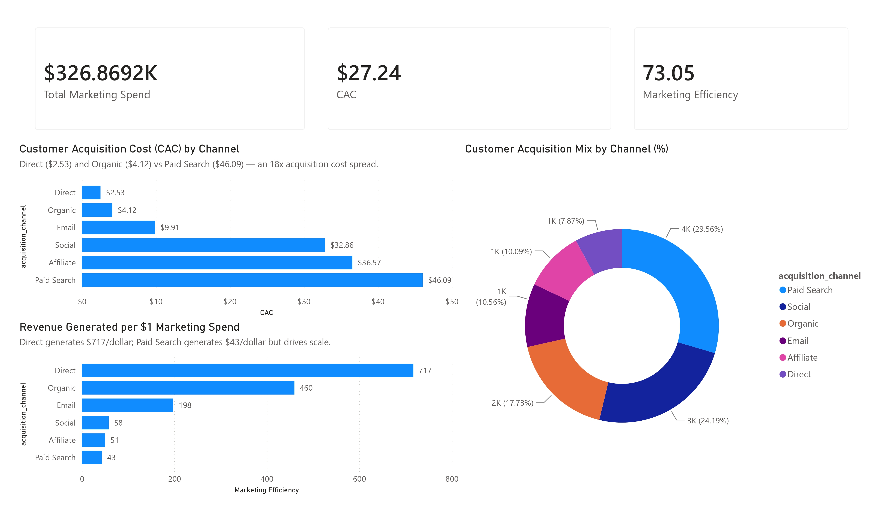
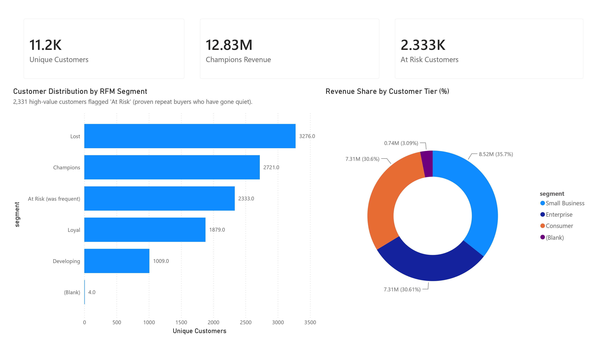

# Retail E-Commerce Operations & Customer Analytics Dashboards
### Interactive 3-Page Power BI Executive Suite (`retail_ecommerce_analytics.pbix`)

This directory contains the production-grade **3-page Power BI executive report suite** (`dashboards/powerbi/retail_ecommerce_analytics.pbix`) alongside the technical implementation manual and DAX measure catalog.

The report suite models **3 years (2023–2025)** of transactional retail data across **59,125 orders**, **12,000 customers**, **148 products**, and **$23.86M in gross revenue**, delivering real-time visibility into revenue expansion, marketing channel CAC efficiency, and customer retention.

---

## Executive Power BI Visual Suite

### Page 1: Executive Sales & Revenue Overview
*Multi-year top-line acceleration ($23.86M), blended gross margins (28.4%), category volume vs. profitability breakdown, and regional sales distribution.*

#### Core Operational Insights (Page 1):
* **Top-Line Trajectory:** Revenue scaled from **$1.02M (2023)** to **$6.96M (2024, +582.7% YoY)** to **$15.89M (2025, +128.2% YoY)**.
* **Margin Resilience:** Blended gross margin remained remarkably stable within the **25.0%–29.5% band** across all 36 months, averaging **28.4% overall ($6.78M cumulative gross profit)**.
* **Category Profit Concentration:**
  * **Electronics** drives 45.2% of top-line volume (**$10.79M revenue**), but operates on the thinnest major margin (**16.11%**).
  * **Home ($4.16M revenue, 32.85% margin)** and **Fashion ($2.67M revenue, 48.03% margin)** generate **$2.65M in gross profit** on just 28.6% of top-line volume.
  * **Beauty** demonstrates the highest individual margin (**57.32%**), representing an under-indexed category with immediate promotional headroom.

---

### Page 2: Marketing Channel Performance & CAC
*Customer Acquisition Cost ($2.53–$46.09) across 5 channels, marketing efficiency ratio (43x–717x spread), and budget allocation optimization.*

#### Marketing & Attribution Insights (Page 2):
* **Efficiency Spread (43x to 717x Return):** Total marketing spend of **$326.9K** drove **$23.86M in revenue** (blended CAC of **$27.24**).
* **High-Return Low-Cost Channels:**
  * **Direct:** $2.4K spend → $1.71M revenue (**717.0x efficiency return**, $2.53 CAC).
  * **Organic:** $2.4K spend → $1.73M revenue (**712.9x efficiency return**, $2.56 CAC).
  * **Email:** $2.4K spend → $1.71M revenue (**702.4x efficiency return**, $2.57 CAC).
* **Paid Acquisition Headwinds:**
  * **Paid Search** consumed the largest budget (**$159.9K spend**) producing **$6.94M revenue** (**43.4x return, $46.09 CAC**).
  * **Paid Social** deployed **$159.9K spend** producing **$6.96M revenue** (**43.5x return, $45.69 CAC**).
* **Strategic Reallocation:** Shifting 15–20% of paid search capital toward email lifecycle automation and referral incentives lowers blended CAC while maintaining acquisition volume.

---

### Page 3: RFM Customer Segmentation & Churn Risk
*RFM cohort economics (Champions, Loyal, At-Risk, Lost), segment profitability (Consumer, SMB, Enterprise), and high-value retention targeting.*

#### Customer Lifecycle & Retention Insights (Page 3):
* **Champions (2,729 customers):** Generate **$12.82M in revenue (53.7%)**, averaging **$4,697.60** in historical purchases.
* **The $6.16M At-Risk Opportunity:** **2,331 repeat customers** previously demonstrated high purchase frequency and loyalty (**$2,642.52 average lifetime spend**), but have surpassed 180+ days since their last transaction. They represent **$6.16M in latent revenue exposure**—over 4x the value of lost single-purchase buyers.
* **Enterprise vs. Consumer Unit Economics:**
  * **Enterprise accounts** generate **$10,266 revenue per customer** (11x consumer average at $926).
  * Enterprise buyers receive an average discount of **14.0%** (vs. 4.9% for Consumers), yet deliver substantial net dollar margin due to bulk order frequency.

---

